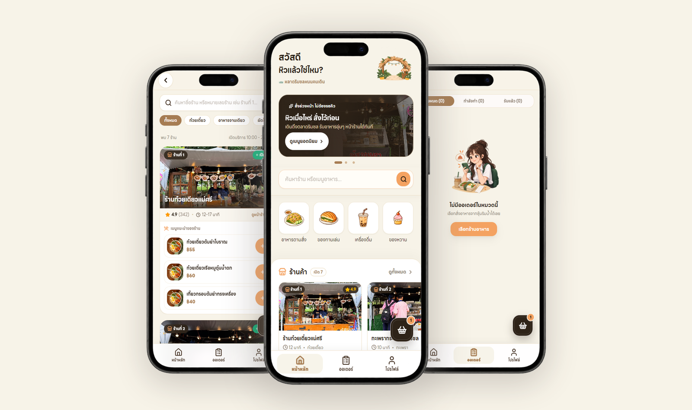
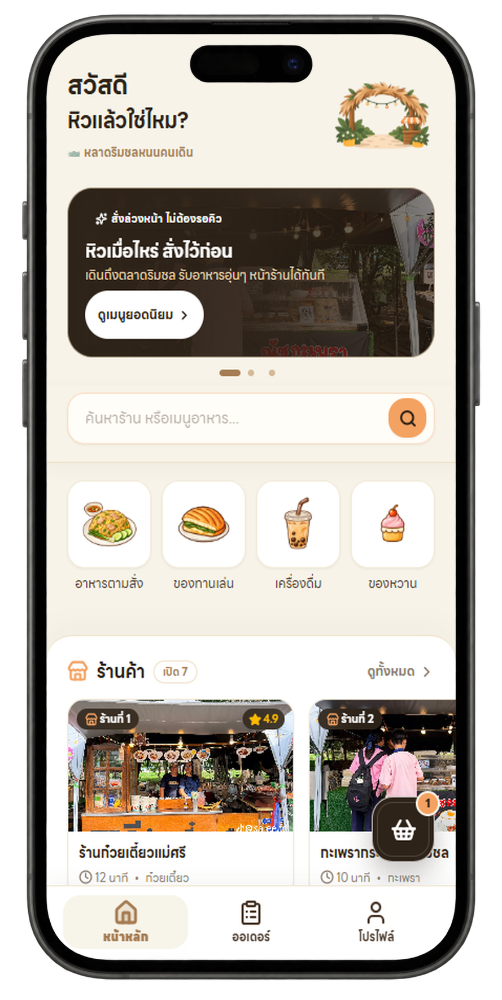
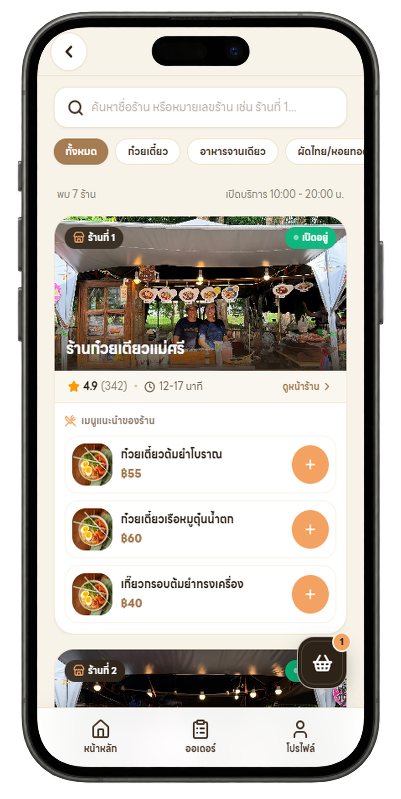
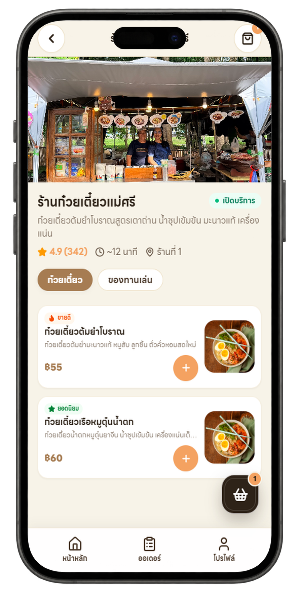
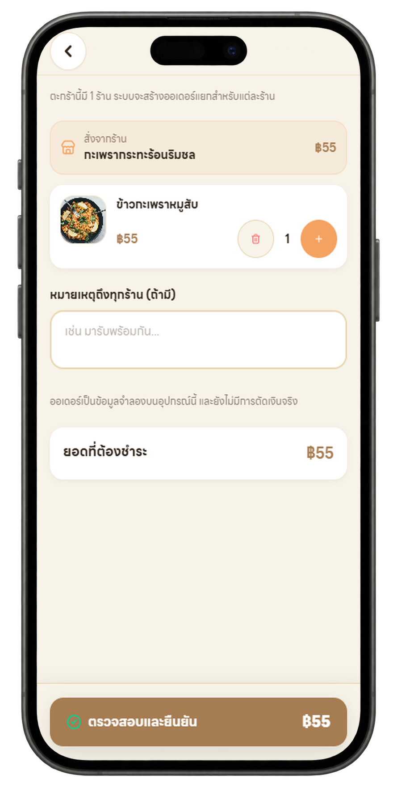
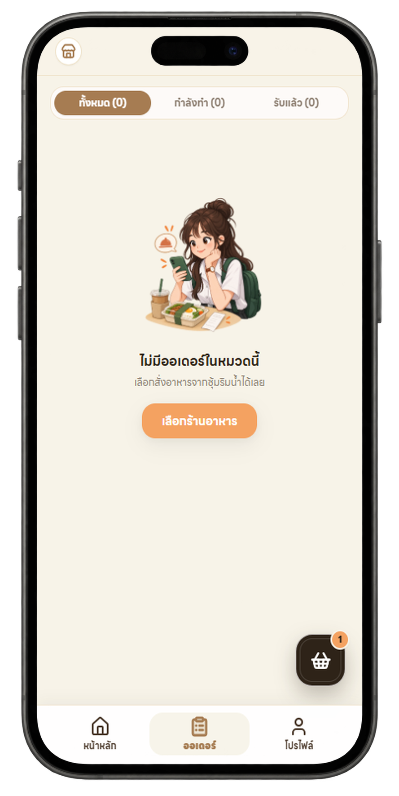
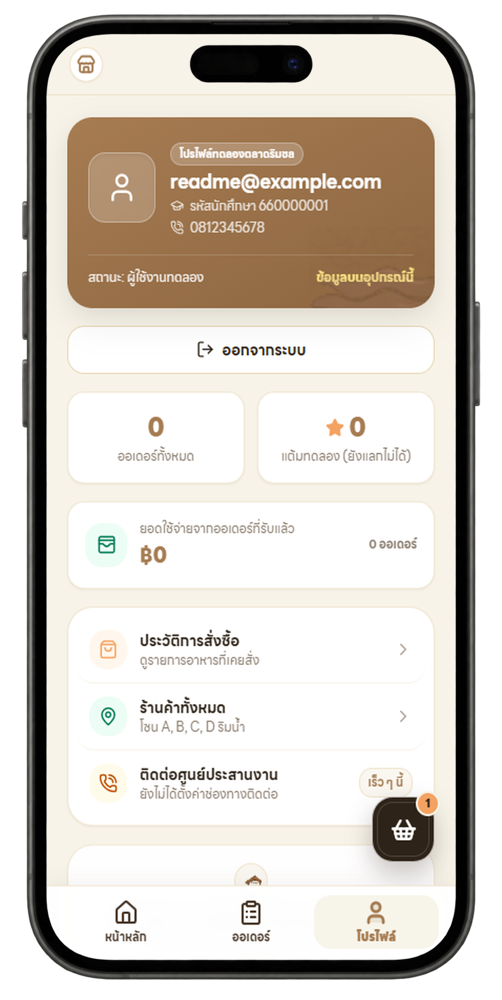

# Lad Rim Chon (หลาดริมชล)

<p align="center">
  
</p>

<h3 align="center">Digital pre-ordering platform for campus food markets.</h3>

<p align="center">
  <b>“Order ahead, pick up quickly, skip the queue.”</b><br>
  Lad Rim Chon is a modern, mobile-first food marketplace and Progressive Web App (PWA) designed to seamlessly connect university students and staff with local wooden market vendors.
</p>

<p align="center">
  <a href="#-getting-started"></a>
  <a href="#-tech-stack"></a>
  <a href="#-tech-stack"></a>
  <a href="#-tech-stack"></a>
  <a href="#-mobile-first--progressive-web-app"></a>
  <a href="#-license"></a>
</p>

<p align="center">
  
</p>

---

##  Overview

**Lad Rim Chon (หลาดริมชล)** is a mobile-first Progressive Web Application built around a simple goal:

> **Bringing the warmth and community of local wooden campus food markets into the digital era with frictionless pre-ordering.**

In Thai, **“หลาด” (Lad)** represents market in southern regional dialect, and **“ริมชล” (Rim Chon)** denotes the waterside ambience. Rather than serving as a traditional delivery app, Lad Rim Chon acts as a **Digital Local Marketplace** tailored specifically for university campus food culture. Students and staff can browse authentic stalls, configure dishes, pre-order ahead of time, and pick up their freshly cooked meals without waiting in crowded lines.

```text
Traditional Campus Market
           │
           ▼
Explore Stalls & Menus on Mobile
           │
           ▼
Customize Items & Pre-order Ahead
           │
           ▼
Stalls Receive Orders & Cook Fresh
           │
           ▼
Walk & Pick Up at Stall (Pickup Code)
```

### Problems Lad Rim Chon Solves

* **Eliminates Long Queues:** No more waiting 15–30 minutes at stalls during rush hours between classes.
* **Reduces Shop-Front Crowding:** Less congestion around narrow wooden market walkways.
* **Real-time Market Visibility:** Instant check on which vendors are currently open and what items are in stock.
* **Organized Vendor Workflow:** Vendors receive structured order tickets instead of managing handwritten paper slips.

---

##  Core Features

### 1. Market & Menu Catalog
* Browse university market stalls with real-time open/closed indicators, operating hours, and category filters.
* Detailed food items with high-resolution photography, descriptions, ratings, and transparent pricing.
* Menu option customization (e.g., spice levels, noodle choices, extra toppings, dietary notes).

### 2. Smart Multi-Vendor Cart
* Add food items from different vendors into a single cart seamlessly.
* Automatic order segregation per market stall at checkout.
* Multi-stage business rule validation (stock availability, mandatory choices, open hours, and price integrity).

### 3. Live Order Tracking & Pickup Code
* Real-time order status simulation: **Pending ➜ In Preparation ➜ Ready for Pickup ➜ Completed**.
* Instant **Pickup Code** & visual verification screen for quick counter identification.
* Order history to review previous meals and receipts.

### 4. Progressive Web App (PWA) & Offline Readiness
* Service Worker caching architecture (`public/sw.js`) for fast page loads and network resilience.
* Installable directly to home screens on iOS and Android with native look and feel.

---

##  Application Preview

Live screens of Lad Rim Chon on mobile devices:

| Home (Market Overview) | Shops (Stall Directory) | Menu (Customization) |
| :---: | :---: | :---: |
|  |  |  |
| Featured stalls, categories & promos | Browse all stalls with open status & tags | Customize choices, spice & add-ons |

| Cart (Checkout Summary) | Orders (Live Tracking) | Profile (User & Auth) |
| :---: | :---: | :---: |
|  |  |  |
| Items grouped per shop with note field | Track preparation status & pickup code | User profile, preferences & session |

---

##  Order & Checkout Flow

```text
Customer
   │
   ▼
Browse Stalls & Customize Menu Options
   │
   ▼
Add to Cart (Redux State)
   │
   ▼
Cart Validation (Business Rules)
   ├── Check Shop Open / Closed Status
   ├── Validate Required Choices & Add-ons
   └── Recalculate Verified Pricing & Stock
   │
   ▼
Confirm Order (Create Order Action)
   │
   ▼
Order Repository ➜ LocalStorage Adapter (or API)
   │
   ▼
Generate Pickup Code & Receipt
   │
   ▼
Live Status: Pending ➜ Cooking ➜ Ready ➜ Completed
```

---

##  Architecture & Design Patterns

The project follows a **Clean Architecture** approach utilizing the **Repository Pattern & Adapter Pattern** to decouple the presentation and state management layers from the data access mechanisms.

```text
                     LadRimChon App
                           │
                  Next.js App Router
                           │
             ┌─────────────┴─────────────┐
             ▼                           ▼
       Presentation                    State
        (UI Layer)                 (Redux Store)
             │                           │
             │     dispatch / select     │
             └─────────────┬─────────────┘
                           │
                           ▼
                  Repository Interfaces
                (Order, Product, Shop)
                           │
             ┌─────────────┴─────────────┐
             ▼                           ▼
    LocalStorage Adapter            API Adapter
       (Current MVP)              (Future Backend)
```

### Architecture Benefits
* **Fast Prototyping (MVP):** Fully functional offline and demoable using the `LocalStorage Adapter` without demanding a live backend server.
* **Seamless Scalability:** Swapping to PostgreSQL, Supabase, or custom REST/GraphQL APIs requires only implementing a new adapter conforming to the existing repository interfaces. No UI or Redux slice modifications are needed.

---

##  Project Structure

```text
LadRimChon/
│
├── public/                     # Static assets & PWA files
│   ├── icons/                  # Web application & PWA icons
│   ├── images/                 # Vendor and food imagery
│   ├── screenshots/            # App screenshots & device mockups
│   │   ├── device-home.png
│   │   ├── device-shops.png
│   │   ├── device-menu.png
│   │   ├── device-cart.png
│   │   ├── device-orders.png
│   │   ├── device-profile.png
│   │   ├── showcase.png
│   │   └── ...
│   └── sw.js                   # PWA Service Worker
│
├── src/
│   ├── app/                    # Next.js App Router
│   │   ├── (customer)/         # Customer Route Group
│   │   │   ├── cart/           # Shopping cart & checkout
│   │   │   ├── menu/[id]/      # Menu item detail & options
│   │   │   ├── orders/         # Order tracking & history
│   │   │   │   └── [id]/pickup # Counter pickup code & QR
│   │   │   ├── profile/        # Customer profile & preferences
│   │   │   ├── shops/          # Shop directory & stall page
│   │   │   ├── layout.tsx
│   │   │   └── page.tsx        # Marketplace Home
│   │   ├── auth/               # Customer authentication
│   │   ├── offline/            # Offline fallback view
│   │   ├── globals.css         # Styling & Tailwind theme tokens
│   │   ├── layout.tsx          # Root layout & providers
│   │   └── manifest.ts         # Web App Manifest
│   │
│   ├── components/             # Reusable UI components
│   │   ├── cart/               # FloatingCart, CartItemCard
│   │   ├── food/               # FoodCard
│   │   ├── home/               # PromoCarousel
│   │   ├── market/             # MarketHeader, MarketNavigation, CategoryCard
│   │   ├── order/              # OrderStatus, PickupCode
│   │   ├── providers/          # Redux, Auth, PWA, AppBoot Providers
│   │   ├── shop/               # ShopCard
│   │   └── ui/                 # Base atomic UI primitives
│   │
│   ├── domain/                 # Core domain data models
│   │   ├── order/              # order.model.ts
│   │   ├── product/            # product.model.ts
│   │   ├── shop/               # shop.model.ts
│   │   └── user/               # user.model.ts
│   │
│   ├── lib/                    # Shared utility functions
│   │   ├── auth.ts             # Auth session helpers
│   │   ├── repositories.ts     # Repository singleton factories
│   │   ├── utils.ts            # Formatting & class merging helpers
│   │   └── validate-cart.ts    # Cart validation engine
│   │
│   ├── repositories/           # Data access abstraction layer
│   │   ├── adapters/           # LocalStorage adapters & seed dataset
│   │   └── interfaces/         # Repository contracts
│   │
│   └── store/                  # Redux Toolkit state management
│       ├── index.ts            # Store configuration
│       └── slices/             # cart, order, session, ui slices
│
├── tests/                      # Automated unit tests
│   └── cart.test.cjs           # Cart logic & validation test suite
│
├── .env.example                # Environment variable sample
├── .gitignore                  # Git ignore rules
├── components.json             # Shadcn configuration
├── LICENSE                     # MIT License
├── next.config.ts              # Next.js configuration
├── package.json                # Dependencies & scripts
├── PROJECT.md                  # Comprehensive specification
├── README.md                   # Project documentation
└── tsconfig.json               # TypeScript configuration
```

---

##  Tech Stack

| Technology | Purpose |
| :--- | :--- |
| **Next.js 16** | Full-stack React framework with Turbopack & App Router |
| **React 19** | Modern UI library with Concurrent Rendering & Hooks |
| **TypeScript** | Type-safe development and resilient data models |
| **Tailwind CSS v4** | Modern utility-first CSS styling |
| **Redux Toolkit** | Centralized client-side state management |
| **Lucide React** | Clean vector iconography |
| **PWA Service Worker** | Cache management and offline app capabilities |
| **Node.js Test Runner** | Fast native unit tests for cart and business logic |

---

##  UI & Brand Identity

The visual language follows a **"Warm & Playful Campus Marketplace"** design direction. The aesthetic channels natural wooden stalls, tree canopies, and riverside breezes to evoke a cozy, friendly, and student-accessible mood:

| Role | Color Name | Hex Code | Purpose |
| :--- | :--- | :--- | :--- |
| **Background** | Warm Cream | `#F7F3E8` | Cozy, welcoming background that avoids screen glare |
| **Primary** | Wood Brown | `#A67C52` | Stalls and timber textures; primary buttons & headers |
| **Secondary** | Sage Green | `#7DA27D` | Foliage & riverside atmosphere; success indicators |
| **Accent** | Market Orange | `#F4A261` | Call-to-action badges, highlights & interactive states |
| **Text** | Dark Brown | `#3D3025` | High-contrast, softer alternative to harsh black |
| **Surface** | Warm White | `#FFFFFF` | Elevated cards, dialogs, and content containers |

---

##  Getting Started

### Prerequisites

* **Node.js**: Version 20.0 or higher, or **Bun**: Version 1.0 or higher
* **npm** or **bun** package manager

### 1. Clone the Repository

```bash
git clone https://github.com/PUKAN223/LadRimChon.git
cd LadRimChon
```

### 2. Install Dependencies

Using npm:
```bash
npm install
```

Or using Bun:
```bash
bun install
```

### 3. Start Development Server

Using npm:
```bash
npm run dev
```

Or using Bun:
```bash
bun run dev
```

Open your browser and navigate to:
```text
http://localhost:3000
```

> **Pro Tip:** For the authentic mobile experience, open DevTools (`F12`) and toggle **Device Emulation** (recommended: iPhone 14 Pro or 390px viewport width).

### 4. Run Unit Tests

Verify cart rules, price computations, and order constraints:
```bash
npm test
```

### 5. Production Build

```bash
npm run build
npm run start
```

---

##  Core Pages & Routes

```text
/
├── (customer)
│   ├── /                 # Marketplace home with promotions & categories
│   ├── /shops            # Vendor directory with filter tabs
│   ├── /shops/[id]       # Individual stall details & food catalog
│   ├── /menu/[id]        # Menu customization & add-to-cart modal
│   ├── /cart             # Multi-vendor cart summary & verification
│   ├── /orders           # Live tracking & order history
│   ├── /orders/[id]      # Order detail breakdown & status steps
│   ├── /orders/[id]/pickup # Quick-scan pickup code & counter receipt
│   └── /profile          # Student profile, settings & preferences
├── /auth                 # Authentication & login flow
└── /offline              # PWA offline fallback screen
```

---

##  Roadmap

* [ ] Persistent database integration (PostgreSQL / Supabase) via Next.js Server Actions
* [ ] Merchant portal for vendors to manage menus, toggle stall status, and accept orders in real time
* [ ] Web Push Notifications when an order transitions to "Ready for Pickup"
* [ ] PromptPay QR Code & digital payment gateway integration
* [ ] Rating and review system for student feedback

---

##  License

This project is licensed under the [MIT License](LICENSE).
